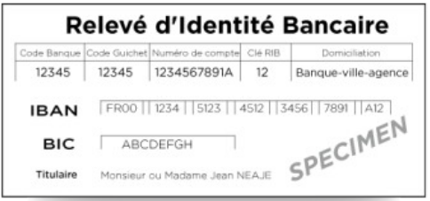

# projet-rib

Programme sur node.js qui vérifie si un Relevé d'identité bancaire est valide ou non

### Description

L'objectif est de déterminer si un RIB est valide. Un RIB est composé de :  

- 5 caractères pour le code banque
- 5 caractères pour le code guichet
- 11 caractères pour le numéro de compte
- 2 chiffres pour la clé RIB

Les caractères peuvent être soit :

- Des chiffres entre 0 et 9
- Des lettres non accentuées entre a et z ou A et Z

### Installation

- Télécharger et Installez Node.js depuis la [site officielle de Node.js](https://nodejs.org)
- Déployer tout les contenus dans un dossier de votre choix.

### Utilisation

- Ouvrir un terminal dans le dossier appelé script/ et tapez node index.js et suivez tout les instructions du programme.

### Fonctionnement du programme

La clé RIB permet de détecter des erreurs dans la transcription du RIB. Sa valeur est calculée
comme suit :

- Chaque lettre est remplacée par le chiffre correspondant (même chiffre pour les
majuscules que pour les minuscules) :  
a, j => 1  
b, k, s => 2  
c, l, t => 3  
d, m, u => 4  
e, n, v => 5  
f, o, w => 6  
g, p, x => 7  
h, q, y => 8  
i, r, z => 9  

- On calcule la somme de : 89 × codedebanque + 15 × codeguichet + 3 × numérodecompte
- La clé RIB est alors égale à 97 moins le modulo 97 de la somme précédente. Le programme va recevoir une série de RIB et va déterminer s'ils sont valides.
- Un RIB est valide si la valeur du clé RIB affichée est égale à la valeur du clé RIB calculée.
